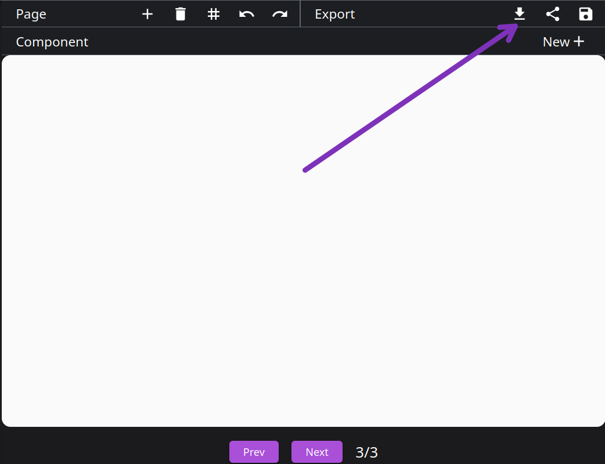

# Exporting and Sharing

Export your diagrams using whichever format best suits your needs. Share your visualization using a link or save it to continue working on it at a later point in time.

### Export <Icon svgName="export" />
Export your visualization as one of the following formats: SVG, PNG, PDF, PPTX, HTML, GIF, Video. Alternatively, you can define your own export format.

---

### Share <Icon svgName="share" />
Generate a URL that can be used to share the diagram.

---

### Save <Icon svgName="save" />
Store the visualization for later use. It can be retrieved using the "Saved" panel in the sidebar. 

**Warning:** The visualization is only stored until cookies are cleared. Thus this method should not be used to store a visualization for the long-term. For long-term storage, use the share feature and save the URL somewhere or copy your code into a text file.

---

## Related
- [GUI](./gui.md) - Guide of user actions
- [Language Reference](./language-reference.md) - Complete syntax guide
