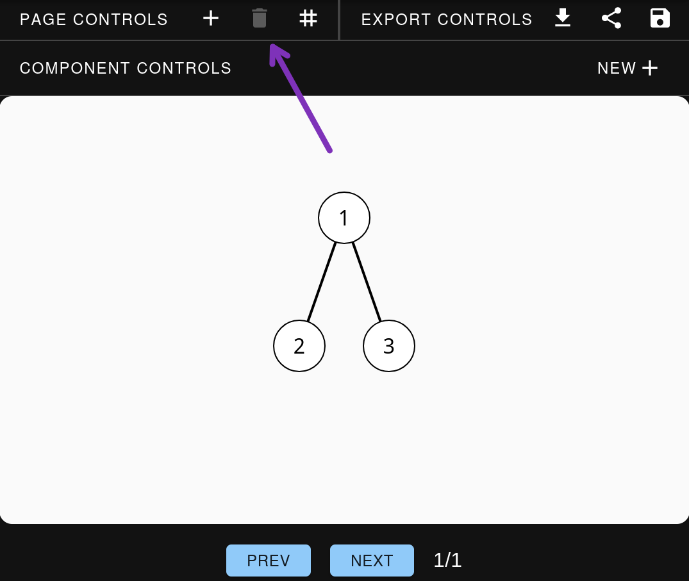

# GUI reference

This is a complete reference of all GUI controls available for creating and manipulating Merlin data structures and pages. The controls are organized by category and indicate which data structures support them.

## Page Controls

### Add Page <Icon svgName="add" />
Creates a new visualization step.

---

### Remove Page <Icon svgName="delete" />
Removes the visualization step that is currently shown.

---

### Set Page Grid <Icon svgName="grid" />
Set a grid. A grid defines different locations where a component can be placed. After a grid is created a component can be positioned
within it.
See more: [Positioning](./positioning.md)

---

## Component Controls

You can open the component controls by **double-clicking** on any unit.

### Create Component
Opens a dropdown that allows you to choose which type of component you would like to create. Once chosen, a separate menu will popup where you can specify the values of the component (for example, nodes and edges for graphs or values for arrays).

Here is a list of what can/must be specified to create each component:

**Array:**  
List of values (can be null)  
Example: 1, null, 3

**Matrix:**  
List of rows and values for those rows (can be null)  
Example: 1, 2, null; 4, 5, 6

**Graph:**  
List of edges (where nodes cannot be null and must be unique)  
Example: a-b, b-c, c-d, d-b

List of values for the nodes (optional)  
Example: a:node3, b:node2, c:special node

**Tree:**  
List of parent-children relations (where parents and children cannot be null and must be unique)  
Example: a-b, b-c, a-d

List of values for nodes (optional)  
Example: a:node3, b:node2, c:special node

**Stack:**  
List of values (can be null)  
Example: 1, null, 3

**LinkedList:**  
List of values (can be null)  
Example: 1, null, 3

**Text:**  
Any string  
Example: "hello!"

**Supported by:** All structures  

---

### Remove Component <Icon svgName="delete" />
Removes the component from the current page and all future pages. 
**Important:** This can only be undone by recreating the component using the GUI or by using the code editor.

**Supported by:** Array, Matrix, Graph, Tree, Stack, LinkedList

---

### Structure & Styling <Icon svgName="structure" />
Set the values, color and arrows of multiple units. Add and/or remove multiple units and/or edges.  

**Array:**  
Set the values, color and arrows of multiple units. Adding and/or removing values adds and/or removes units.

**Matrix:**  
Set the values, color and arrows of multiple units. Add and/or remove rows and columns by adding and/or removing values.

**Graph:**  
Set the values, color and arrows of multiple nodes. Add and/or remove nodes and edges.

**Tree:**  
Set the values, color and arrows of multiple nodes. Add and/or remove nodes and edges.

**Stack:**  
Set the values, color and arrows of multiple units. Adding or removing values adds and/or removes units.

**LinkedList:**  
Set the values, color and arrows of multiple units. Adding or removing values adds and/or removes units.

**Supported by:** Array, Matrix, Graph, Tree, Stack, LinkedList

---

### Text <Icon svgName="text" />
Add text above, below, to the left or to the right of the component.
To remove the text, simply remove it from the input field.

**Supported by:** Array, Matrix, Graph, Tree, Stack, LinkedList

---

### Position <Icon svgName="grid" />
Position the component within the grid. This only works if a grid has been defined for the current page.
To define a grid, see the 

**Supported by:** Array, Matrix, Graph, Tree, Stack, LinkedList

See more: [Positioning](./positioning.md)

---

## Unit Controls

You can open the unit controls by **clicking** on any unit.

### Edit Value <Icon svgName="edit" />
Change the value of the node. If the field is left empty, the value will be set to null.

**Supported by:** Array, Stack, Matrix, Graph, Tree, LinkedList

---

### Edit Color <Icon svgName="color" />
Sets the color at a specific index.

**Supported by:** Array, Matrix, Graph, Tree, Stack, LinkedList

---

### Edit Label <Icon svgName="label" />
Sets the arrow/label at a specific index.

**Supported by:** Array, Matrix, Graph, Tree, Stack, LinkedList

---

### Add Unit <Icon svgName="add" />
Add a unit.

**Array:**  
Add a unit with that value after the current unit.

**Graph:**  
Add a node anywhere in the graph.

**Tree:**  
Add a node as a child of the current node.

**Stack:**  
Add a unit with that value above the current unit.

**LinkedList:**  
Add a unit with that value after the current unit.

**Supported by:** Array, Graph, Stack, LinkedList, Tree

---

### Add Row <Icon svgName="add-row"/>
Add a row below the current row.

**Supported by:** Matrix

---

### Add Column <Icon svgName="add-column" />
Add a row to the right of the current row.

**Supported by:** Matrix

---

### Remove Unit <Icon svgName="remove" />
Removes the current unit. For graph nodes, all edges with this node will also be deleted.

**Supported by:** Array, Graph, Tree, Stack, LinkedList

---

### Remove Row <Icon svgName="remove-row" />
Removes the row that contains the current unit.

**Supported by:** Matrix

---

### Remove Column <Icon svgName="remove-column" />
Removes the column that contains the current unit.

**Supported by:** Matrix

---

### Remove Subtree <Icon svgName="remove-subtree" />
Removes the current unit and all children of this unit.

**Supported by:** Tree