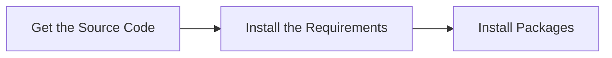

# Development
## Overview
The Merlin Editor is a project developed by the ETH PEACH Lab, designed to provide users more convenient experience for making algorithms visualizations, by extending and integrating the Mermaid diagramming tool into a graphical user interface (GUI). This integration facilitates the creation and visualization of data structures directly within the application using customized domain specific languages (DSL).

## Features
- **Customized Domain Specific Language**: *Merlin* and *Merlin-Lite* are developed as DSL to serve for our project. They are easy-to-learn for any users with some programming background. They are also very extensible for customized usage, for instance, add a new pattern of data structure.
- **Mermaid-extension Plugin Integration**: Easily generate visualizations of data structure like array, graph etc., using the Mermaid-likewise extention and workflow.
- **GUI Focus**: The project is designed around improving the user experience with graphical interfaces for visulization rendering.
- **Open-Source**: The code is open-source and can be modified and extended to suit different needs.

## Installation
To develop *Merlin* project or customize your own extensions, you need to setup first on your local environment. The setup has 3 main steps:



To install and run the Merlin project, make sure you have **npm** or **pnpm** and **nvm** installed on your system. If not, you can refer to these pages to install the requirements packages:  
- https://nodejs.org/en/download/package-manager  
- https://pnpm.io/  

Check the installment of required packages on your system by: 
```bash
# download and install Node.js (you may need to restart the terminal)
nvm install 22
# verifies the right Node.js version is in the environment
node -v # should print `v22.11.0` or higher
# verifies the right npm version is in the environment
npm -v # should print `10.9.0` or higher
# verifies the right pnpm version
pnpm -v # should print `10.9.0` or higher
```


Then follow these steps:

1. Clone the repository:

    ```bash
    git clone https://github.com/ETH-PEACH-Lab/merlin.git
    cd merlin
    ```

2. Install dependencies:

    ```bash
    pnpm install
    ```

3. After installation, you can start the project locally with:

    ```bash
    pnpm run build
    pnpm run dev
    ```
4. After development, you can deploy the new Merlin Project onto website via
    
    ```bash
    pnpm run deploy
    ```
    

This command will launch the application with the integrated Merlin plugin ready to render visualizations.

If you meet errors similar to 
```bash
ERROR in ./src/main.jsx
Module build failed: Error: Cannot find module 'fs/promises'  
Require stack:
/node_modules/.pnpm/webpack@5.92.1_webpack-cli@5.1.4/node_modules/webpack/bin/webpack.js
    at Function.Module._resolveFilename (internal/modules/cjs/loader.js:794:15)
    at Function.Module._load (internal/modules/cjs/loader.js:687:27)
    at Module.require (internal/modules/cjs/loader.js:849:19)
    at require (internal/modules/cjs/helpers.js:74:18)
    at Object.<anonymous>   
node_modules/.pnpm/babel-loader@9.1.3_@babel+core@7.24.7_webpack@5.92.1_webpack-cli@5.1.4_/node_modules/babel-loader/lib/cache.js:21:5)
    at Module._compile (internal/modules/cjs/loader.js:956:30)
    at Object.Module._extensions..js (internal/modules/cjs/loader.js:973:10)
    at Module.load (internal/modules/cjs/loader.js:812:32)
    at Function.Module._load (internal/modules/cjs/loader.js:724:14)
    at Module.require (internal/modules/cjs/loader.js:849:19)
```
Please try to update your node version and switch to updated version by
```bash
//switch to 20 ver. node
nvm use 20
```


## Usage

Once the application is running on the browser, you can begin using the GUI and Merlin syntax to generate Mermaid visualizations. The project is designed to allow easy integration of direct-manipulations via graphical interface to syntax for visualization.

### Steps to Use the Application

1. **Launch the Application**  
   - Open your browser and navigate to the hosted application or the local development server.  
   - You will be greeted with the **Merlin Editor**, showcasing the workspace where diagrams can be created and modified.

2. **Start Creating Diagrams**  
   - Use the **Code Editor** to directly enter the Merlin or Merlin-Lite syntax. This syntax is automatically parsed into Merlin Visualizations.
   - Alternatively, interact Visualizations with the diagram using the graphical interface, which updates the syntax dynamically and automatically.

3. **Real-Time Rendering**  
   - All modifications—whether made in syntax or via the GUI—are rendered in real-time in the **preview pane**.  
   - The rendering uses extended Mermaid.js to generate high-quality visual representations of your visual elements.

2. **Export and Save**  
   - Once satisfied with your visualization, you can export it in multiple formats, such as:
     - PNG/SVG images for embedding in documents.
     - PDF format for integration into other tools and projects.

3. **Integration and Sharing**  
   - The tool has potential for easy integration with external workflows, making it ideal for using Merlin syntax in documentation, development, or presentations.  
   - Simply copy the syntax or save the visualizations for reuse.

### Example Workflow

1. **Start by typing a simple flowchart syntax in the Merlin Editor.** Example:
   ```mermaid
   graph TD
     A[Melrin Syntax] --generate & revise--> B[Visual Elements]
    B--update-->A
     B --> C[Export Visuals]
    D[Graphic User Interface] --revise--> B
    ```

## Project Structure
The project's structure is organized as:

```python
merlin/
├── .monaca/                # Configuration directory for Monaca (cloud-based IDE)
├── res/                    # Resource folder for assets like images or styles
├── src/                    # Source code folder containing the main application logic
│   ├── components/         # Reusable UI components
├── test/                   # Unit tests and integration tests for the application
├── .gitignore              # Specifies files and folders to ignore in Git version control
├── .monacaignore           # Specifies files to exclude from Monaca's build process
├── LICENSE                 # License file (likely MIT) detailing usage rights
├── config.xml              # Configuration file for project settings (e.g., app metadata)
├── langium-config.json     # Configuration for Langium, a framework for DSLs
├── package.json            # NPM package configuration file for managing dependencies
├── pnpm-lock.yaml          # Lockfile for pnpm, ensuring consistent dependency versions
└── webpack.config.js       # Webpack configuration for building and bundling the app
```  
The Configuration of the project are mainly in `package.json` and `webpack.config.js`, including metadata, dependency management, script definition, versioning, dependency tracking.  

The code for the app functions are mainly under the `\src` folder. The structure under `\src` is organized as:
```python
src/
├── compiler/               # Code responsible for compiling DSL to the target format
├── components/             # Reusable UI components
├── examples/               # Example implementations or configurations
├── hardcode/               # Hardcoded values or constants used in the app
├── libs/                   # Third-party libraries or internal modules
├── parser/                 # Logic for parsing DSL or input files
├── public/                 # Public assets, such as images or static files
├── App.css                 # Stylesheet for the main App component
├── App.jsx                 # Main App component
├── Theme.js                # Theme configuration or styling logic
├── examples.js             # Example scripts or demonstrations
├── generateExamples.js     # Script for generating examples dynamically
├── index.css               # Global stylesheet
└── main.jsx                # Main entry point of the application

```

The `src` directory contains the core files and folders that make up the project. Each entry in this directory serves a specific purpose in the overall structure of the application. Below is a detailed explanation of the structure.

#### `compiler/`
- Contains the logic responsible for compiling the Domain-Specific Language (DSL) into a target format.
- **Purpose**: Handles the transformation of user-defined syntax into actionable output for rendering or exporting.

#### `components/`
- Includes reusable UI components that can be used across the application.
- **Examples**: Common elements like headers, footers, buttons, or widgets.
- **Purpose**: To ensure modularity and reusability of UI elements, making the app easier to maintain and extend.

#### `libs/`
- Contains third-party libraries or internal modules used by the application.
- **Purpose**: Provides additional functionality not included in the core application logic.

#### `parser/`
- Implements logic for parsing the Merlin DSL or other input formats.
- **Purpose**: Converts raw user input into a structured format that the application can process.

#### `public/`
- Includes static assets such as images, fonts, and other public-facing files.
- **Purpose**: Provides resources that are directly accessible by the browser or referenced in the project.

#### `App.css`
- Stylesheet for the main `App.jsx` component.
- **Purpose**: Defines the visual appearance of the main application structure.

#### `App.jsx`
- The main component that serves as the entry point for rendering the app's UI.
- **Purpose**: Sets up the basic structure and renders child components.

#### `Theme.js`
- Contains theme-related configurations such as colors, fonts, or global styles.
- **Purpose**: Provides a centralized way to manage the app's appearance and styling consistency.

#### `examples.js`
- Contains predefined example scripts or data for testing or showcasing features.
- **Purpose**: Provides ready-to-use configurations to simplify onboarding and demonstration.

#### `index.css`
- Global stylesheet for the application.
- **Purpose**: Defines base styles and resets applied across the entire app.

#### `main.jsx`
- The main entry point of the application.
- **Purpose**: Initializes the app and renders the root component into the DOM.

### **How to Use the Structure**

1. **Understanding the Compiler and Parser**
   - The `compiler/` and `parser/` folders handle the backend logic of converting user input (DSL) into a format that can be rendered or exported.
   - Modify these directories if you are extending or refining how input is processed.

2. **Customizing the UI**
   - Use the `components/` folder to add or update reusable UI elements.
   - Adjust `App.jsx` to change the structure of the main application layout.

3. **Adding New Examples**
   - Place new examples in the `examples/` folder.
   - Use or update `generateExamples.js` to dynamically create or showcase more examples.

4. **Styling**
   - Modify `Theme.js` for global theme changes.
   - Update `App.css` or `index.css` for specific styling needs.

5. **Working with Static Assets**
   - Add images or other public resources to the `public/` folder to make them accessible in the app.


#### **Best Practices**
- **Separation of Concerns**: Keep core logic (`compiler/`, `parser/`) and UI logic (`components/`) separate to maintain clarity and modularity.

This paragraph provides an overview of the structure and a guide for contributors and maintainers to work efficiently with the project.


## Domain Specific Language
We use `langium` and `nearley.js` in this project as domain specific language engine. Here is a brief introduction of how to use this two language engine in our project. For detailed documentation, please refer to their official blogs.  
[langium docs](https://langium.org/docs/introduction/)  
[nearley.js docs](https://nearley.js.org/)


### Nearley.js

#### Usage of Nearley.js in the Merlin Project

In the `merlin` project, **Nearley.js** is utilized to parse a custom Domain-Specific Language (DSL) *Merlin-lite* into a format that can be rendered as visual diagrams using extended **Mermaid.js**. This integration allows users to define diagrams through a textual DSL, which Nearley.js processes to generate the corresponding visual representations.

#### Key Components Involving Nearley.js

1. **Grammar Definition**
   - The project includes a grammar file, typically named `merlin.ne`, which outlines the syntax rules of the custom DSL.
   - This file defines how various elements of the DSL are structured and interpreted.

2. **Parser Generation**
   - Using Nearley.js, the grammar file is compiled into a parser.
   - This parser reads the DSL input and converts it into an Abstract Syntax Tree (AST) or a similar intermediate representation.

3. **Integration with Mermaid.js**
   - The output from the Nearley.js parser is transformed into merlin-lite by compiler.js.
   - This transformation enables the rendering of visual elements defined by the custom DSL within the application.


#### Workflow Overview

1. **Syntax Definition**
   - Developer write syntax definition using the configureation file of nearley.js.

2. **Parsing**
   - Nearley.js processes the DSL input based on the defined grammar, producing an intermediate representation. Use parser.js under `/parser` folder to do this process.

3. **Transformation**
   - The intermediate representation is converted into each linguistic part and use compiler.js to compile it into Merlin-lite syntax.

4. **Rendering**
   - Mermaid.js renders the final visual diagram within the application interface.

#### Benefits of Using Nearley.js

- **Flexibility**: Nearley.js allows the creation of a robust and flexible grammar for parsing the custom DSL.
- **Integration**: Seamlessly integrates with the application workflow to bridge the DSL and extended Mermaid.js.
- **Dynamic Diagram Generation**: Provides a powerful way for users to create and visualize diagrams through textual input.


### Usage of Langium in the Merlin Project

Langium is a framework for building domain-specific languages (DSLs) and their accompanying toolchains. In the `merlin` project, Langium is used to facilitate the creation and processing of the custom DSL `merlin` and connect it to `mermaid.js`.


#### Key Features of Langium in the Project

1. **DSL Grammar Definition**
   - Langium is used to define the grammar of the `merlin` DSL.
   - The grammar specifies the syntax and structure of the DSL, enabling the application to interpret user inputs correctly.
   - The grammar is defined in a `.langium` configuration file or DSL schema file.

2. **Code Generation**
   - Langium generates a parser, lexer, and other utilities based on the defined DSL grammar.
   - This generated code is used by the application to process DSL inputs dynamically.

3. **Syntax Validation**
   - Langium provides built-in capabilities for validating the syntax of DSL inputs.
   - Errors in the user-defined DSL (e.g., missing or invalid keywords) are caught and displayed in the editor, enhancing the user experience.

4. **Integration with the Parsing Workflow**
   - Langium integrates with the overall application pipeline to process DSL input, validate it, and transform it into a representation suitable for rendering.
   - This representation is passed downstream (e.g., to a Nearley.js-based compiler or directly to rendering logic).

#### Workflow Overview

1. **Grammar Definition**
   - A grammar `.langium` file is defined in Langium, specifying the rules of the `merlin` DSL.

2. **Parser Generation**
    - run command `pnpm run build` to generate parser 
   - Langium generates the parser and other utilities required to process DSL inputs based on the grammar.

3. **User Input**
   - Users write DSL definitions in the editor. Langium validates the syntax in real time and provides suggestions or error messages.

4. **Processing**
   - Valid DSL inputs are parsed into an Abstract Syntax Tree (AST) or a similar structured representation.

5. **Output**
   - The processed DSL is transformed into a format compatible with rendering tools such as Mermaid.js.

#### Benefits of Using Langium in Merlin

- **Simplified DSL Development**: Langium automates much of the work involved in creating and maintaining the DSL grammar and toolchain.
- **Robust Error Handling**: Langium catches and reports syntax errors early, reducing potential issues downstream.
- **Extensibility**: The Langium framework can be extended to add new features to the DSL or enhance the editor experience.

## Related Projects

`Merlin` project repo: https://github.com/ETH-PEACH-Lab/merlin  
`Merlin` Tutorial repo: https://github.com/ETH-PEACH-Lab/intuition-vis-tutorial  
`Mermaid` Extension repo: https://github.com/ETH-PEACH-Lab/mermaid-merlin/tree/develop