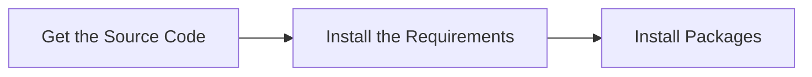

# Development
## Installation
To develop *Merlin* project or customize your own extensions, you need to setup first on your local environment. The setup has 3 main steps:



To install and run the Merlin project, make sure you have **npm** or **pnpm** and **nvm** installed on your system. If not, you can refer to these pages to install the requirements packages:  
- https://nodejs.org/en/download/package-manager  
- https://pnpm.io/  

Check the installment of required packages on your system by: 
```bash
# download and install Node.js (you may need to restart the terminal)
nvm install 22
# verifies the right Node.js version is in the environment
node -v # should print `v22.11.0` or higher
# verifies the right npm version is in the environment
npm -v # should print `10.9.0` or higher
# verifies the right pnpm version
pnpm -v # should print `10.9.0` or higher
```


Then follow these steps:

1. Clone the repository:

    ```bash
    git clone https://github.com/ETH-PEACH-Lab/merlin.git
    cd merlin
    ```

2. Install dependencies:

    ```bash
    pnpm install
    ```

3. After installation, you can start the project locally with:

    ```bash
    pnpm run build
    pnpm run dev
    ```
4. After development, you can deploy the new Merlin Project onto website via
    
    ```bash
    pnpm run deploy
    ```
    

This command will launch the application with the integrated Merlin plugin ready to render visualizations.

If you meet errors similar to 
```bash
ERROR in ./src/main.jsx
Module build failed: Error: Cannot find module 'fs/promises'  
Require stack:
/node_modules/.pnpm/webpack@5.92.1_webpack-cli@5.1.4/node_modules/webpack/bin/webpack.js
    at Function.Module._resolveFilename (internal/modules/cjs/loader.js:794:15)
    at Function.Module._load (internal/modules/cjs/loader.js:687:27)
    at Module.require (internal/modules/cjs/loader.js:849:19)
    at require (internal/modules/cjs/helpers.js:74:18)
    at Object.<anonymous>   
node_modules/.pnpm/babel-loader@9.1.3_@babel+core@7.24.7_webpack@5.92.1_webpack-cli@5.1.4_/node_modules/babel-loader/lib/cache.js:21:5)
    at Module._compile (internal/modules/cjs/loader.js:956:30)
    at Object.Module._extensions..js (internal/modules/cjs/loader.js:973:10)
    at Module.load (internal/modules/cjs/loader.js:812:32)
    at Function.Module._load (internal/modules/cjs/loader.js:724:14)
    at Module.require (internal/modules/cjs/loader.js:849:19)
```
Please try to update your node version and switch to updated version by
```bash
//switch to 20 ver. node
nvm use 20
```


## Usage

Once the application is running on the browser, you can begin using the GUI and Merlin syntax to generate Mermaid visualizations. The project is designed to allow easy integration of direct-manipulations via graphical interface to syntax for visualization.

### Steps to Use the Application

1. **Launch the Application**  
   - Open your browser and navigate to the hosted application or the local development server.  
   - You will be greeted with the **Merlin Editor**, showcasing the workspace where diagrams can be created and modified.

2. **Start Creating Diagrams**  
   - Use the **Code Editor** to enter Merlin-Lite syntax. 
   - Alternatively, use the graphical user interface directly.
   - All modifications—whether made in syntax or via the GUI—are rendered in real-time in the **preview pane**.  
   - The rendering uses extended Mermaid.js to generate high-quality visual representations of your visual elements.

3. **Export, Save and Share**  
   - Once satisfied with your visualization, you can export it in multiple formats, such as:
     - PNG/SVG images for embedding in documents.
     - PDF format for integration into other tools and projects.

## Project Structure
The project's structure is organized as:

```python
merlin/
├── res/                    # Resource folder for assets like images or styles
├── src/                    # Source code folder containing the main application logic
├── test/                   # Unit tests and integration tests for the applicationd
├── config.xml              # Configuration file for project settings (e.g., app metadata)
├── package.json            # NPM package configuration file for managing dependencies
└── webpack.config.js       # Webpack configuration for building and bundling the app
```  
The configuration of the project are mainly in `package.json` and `webpack.config.js`, including metadata, dependency management, script definition, versioning, dependency tracking.  

The code for the app functions are mainly under the `\src` folder. The structure under `\src` is organized as:
```python
src/
├── compiler/               # Code responsible for compiling DSL to the target format
├── components/             # Reusable UI components
├── context/                # Context shared by components
├── parser/                 # Logic for parsing DSL or input files
├── public/                 # Public assets, such as images or static files
├── utils/                  # Helper functions used by various components
├── App.jsx                 # Main App component for rendering the app's UI.
├── Theme.js                # Theme configuration or styling logic
├── examples.js             # Example scripts or demonstrations
├── index.css               # Stylesheet for the main App component
├── generateExamples.js     # Script for generating examples dynamically
├── index.css               # Global stylesheet
└── main.jsx                # Main entry point of the application

```

### **How to Use the Structure**

1. **Understanding the Compiler and Parser**
   - The `compiler/` and `parser/` folders handle the backend logic of converting user input (DSL) into a format that can be rendered or exported.
   - Modify these directories if you are extending or refining how input is processed.

2. **Customizing the UI**
   - Use the `components/` folder to add or update reusable UI elements.
   - Adjust `App.jsx` to change the structure of the main application layout.

3. **Adding New Examples**
   - Place new examples in the `examples/` folder.
   - Use or update `generateExamples.js` to dynamically create or showcase more examples.

4. **Styling**
   - Modify `Theme.js` for global theme changes.
   - Update `App.css` or `index.css` for specific styling needs.

5. **Working with Static Assets**
   - Add images or other public resources to the `public/` folder to make them accessible in the app.


#### **Best Practices**
- **Separation of Concerns**: Keep core logic (`compiler/`, `parser/`) and UI logic (`components/`) separate to maintain clarity and modularity.


### Nearley.js - Domain Specific Language
We use `nearley.js` in this project as domain specific language engine. Here is a brief introduction of how to use this language engine in our project. For detailed documentation, please refer to the official blog.  
[nearley.js docs](https://nearley.js.org/)


#### Usage of Nearley.js in the Merlin Project

In the `merlin` project, **Nearley.js** is utilized to parse a custom Domain-Specific Language (DSL) *Merlin-lite* into a format that can be rendered as visual diagrams using extended **Mermaid.js**. This integration allows users to define diagrams through a textual DSL, which Nearley.js processes to generate the corresponding visual representations.

#### Key Components Involving Nearley.js

1. **Grammar Definition**
   - The project includes a grammar file, named `merlin.ne`, which outlines the syntax rules of the custom DSL. This file defines how various elements of the DSL are structured and interpreted.

2. **Parser Generation**
   - Using Nearley.js, the grammar file is compiled into a parser. This parser reads the DSL input and converts it into an Abstract Syntax Tree (AST) or a similar intermediate representation.

3. **Integration with Mermaid.js**
   - The output from the Nearley.js parser is transformed into merlin-lite by compiler.js. This transformation enables the rendering of visual elements defined by the custom DSL within the application.


#### Workflow Overview

1. **Syntax Definition**
   - Developer write syntax definition using the configureation file of nearley.js.

2. **Parsing**
   - Nearley.js processes the DSL input based on the defined grammar, producing an intermediate representation. Use parser.js under `/parser` folder to do this process.

3. **Transformation**
   - The intermediate representation is converted into each linguistic part and use compiler.js to compile it into Merlin-lite syntax.

4. **Rendering**
   - Mermaid.js renders the final visual diagram within the application interface.

#### Benefits of Using Nearley.js

- **Flexibility**: Nearley.js allows the creation of a robust and flexible grammar for parsing the custom DSL.
- **Integration**: Seamlessly integrates with the application workflow to bridge the DSL and extended Mermaid.js.
- **Dynamic Diagram Generation**: Provides a powerful way for users to create and visualize diagrams through textual input.


## Related Projects
As part of this project, we collected 400 algorithm intuition slides. <br />
`Intuition Visualizer` project repo: https://eth-peach-lab.github.io/intuition-visualisation/ 

We also have a repo for modifying Mermaid code.  <br />
`Mermaid` extension repo: https://github.com/ETH-PEACH-Lab/mermaid-merlin/tree/develop

## Acknowledgements & Contributors

Contributors (sorted by first name):

- **Megan Marty** ([GitHub](https://github.com/megan-marty))
- **Shu Wang** ([LinkedIn](https://www.linkedin.com/in/shu-wang-488bb5138/), [GitHub](https://github.com/rainintime7))
- **Silvan Metzker** ([LinkedIn](https://www.linkedin.com/in/silvan-metzker-515ab9200), [GitHub](https://github.com/Silvan-M))